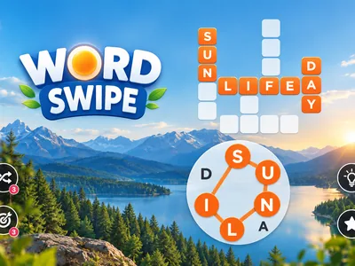
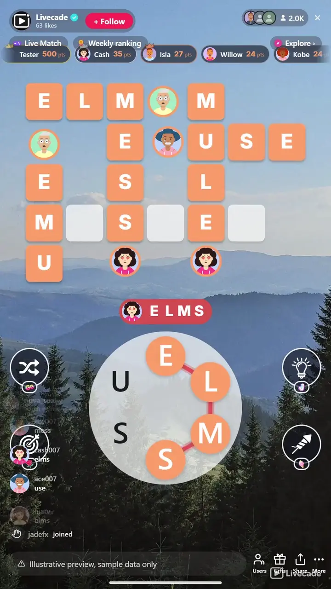

# Word Swipe - Interactive TikTok Live Game

> One ring of letters, a board of crossing words, and a chat that spells them out.

One wheel of letters and a board of crossing words, all built from the same letters. Viewers type a word they can spell from the wheel and it lands on the board with their picture beside it. Solving one word hands the chat a clue to the rest.

**[Play Word Swipe on Livecade](https://livecade.io/games/word-swipe/?utm_source=github&utm_medium=readme&utm_campaign=word-swipe)** - runs as a single browser source in OBS, Streamlabs, or TikTok LIVE Studio. Nothing for viewers to install.

## How viewers play

Viewers take part with the actions TikTok already gives them: **comments**, **gifts**, **likes**, **follows**, **shares**. Every action below is rebindable, so you decide which interaction drives which effect.

| Action | What it does |
| --- | --- |
| **Solve a Word** | A crosshair hunts down the shortest word still hidden, locks on and fills it in, credited to whoever triggered it |
| **Reveal a Letter** | Uncovers one random hidden letter somewhere on the board. If it happens to complete a word, that word solves and credits the sender |
| **Firework: Uncover a Word** | Sends a rocket along the fullest row or column, uncovering every hidden letter on that line and solving any word it finishes |
| **Shuffle the Wheel** | Reorders the ring of letters. It changes no answers, it just gives a stuck chat a new way to look at them, and it is throttled across all viewers at once |

## How it works

### Type a word from the wheel

Every word on the board is spellable from the letters in the ring below it. A viewer types one in chat and it fills in, with their picture pinned beside it.

### Each solve is a clue to the rest

The words share one letter set and cross each other on the board, so every answer that lands cuts down what the remaining ones can be.

### The board decides when it ends

There is no round timer. The board stays up until its last word is solved, then a new one generates a few seconds later.

### Four buttons around the wheel

Shuffle the ring, solve a word, uncover a single letter, or fire a rocket down a whole grid line. Each one is drawn on screen only when you have actually bound it.

## About the game

Word Swipe puts a small crossword on your stream where every answer is spelled from one shared ring of letters. Four to six words cross each other on the board, the wheel below holds the six to eight letters they all come from, and anyone watching can type a word the moment they spot it. There is no turn order and nothing to learn first: the letters are on screen, and the words are made of those letters.

### The wheel is the clue

Because every word uses the same letters, each one your chat solves narrows what the others can be. A viewer who cannot see any word yet can still read the ring and try something, and a wrong guess costs nothing but a quiet blip. Guesses match with or without accents, so a word typed flat on a phone still counts.

### The board keeps a record of who solved it

Every solved word fills in your accent colour and pins the solver profile picture to its end, so a finished board shows who was watching. One word carries a star and pays double, and it is never the obvious one: the star goes to the longest word that is not simply the wheel itself.

### Nothing ends on a clock

A board finishes when the chat has solved every word, not when a timer runs out, so a quiet stretch never cuts a board short and a slow room is never punished. When the last word lands the board celebrates, then builds itself a fresh one a few seconds later.

## What it looks like on stream

[Watch Word Swipe gameplay](https://cdn.livecade.io/games/word-swipe.mp4)

## What you can configure

- **Language** - Ten languages, each drawing boards from its own word bank rather than a translated one
- **Your word bank** - Hide, restore or add words in your language from the content manager
- **Seconds between boards** - How long a finished board celebrates before the next one builds
- **Seconds between guesses per viewer** - A per-viewer cooldown, or none at all, so a fast typist cannot spam the board
- **Seconds between wheel shuffles** - A global throttle, not per viewer: the wheel is one shared object
- **Show who solved each word** - Pins the solver picture and name to the word they got
- **Show points leaderboard** - A top strip of scorers, with up to fifty entries. It scrolls only once the names stop fitting
- **Game style** - Light or dark empty squares, so the board reads against whatever is behind it
- **Accent and letter colour** - The colour of every solved letter, the guessed word, the star and the scoreboard, plus the letters drawn on them
- **Background** - Transparent, a solid colour, or your own image behind the board and wheel
- **Your sounds** - Swap any of the eleven sound effects for your own audio
- **Who can play** - Everyone, followers only, or your fans club only. Applies to comments and gifts

## Languages

English, Spanish, Portuguese, French, German, Italian, Indonesian, Turkish, Russian, Romanian

## FAQ

<strong>How do viewers play Word Swipe?</strong>

They type in chat. Every word on the board is spelled from the ring of letters below it, so a viewer reads the ring, works out a word and types it. There is no turn order and no queue, and anyone who arrives mid-board can still take the last word.

<strong>What happens on a wrong guess?</strong>

The word they typed appears briefly and fades, with a quiet blip. There are no strikes and no penalty, because the board is cooperative. You can set a short per-viewer cooldown if you want to slow down rapid guessing, but it ships with none.

<strong>Do gifts decide who wins?</strong>

No. Gifts buy help for the whole room: a letter, a word, a line of letters, or a reshuffled wheel. Every one of them is credited to the sender, but the board is solved together and the points go to whoever types each word.

<strong>Do the actions have to be gifts?</strong>

No. All four ship bound to a one-coin gift each so viewers can discover them, but any of them can be moved onto likes, follows, shares, joins or a chat keyword instead. The buttons on screen redraw to show whatever you actually set.

<strong>Is there a time limit?</strong>

No. A board ends only when every word on it has been solved, so a quiet chat is never cut off mid-board. Once the last word lands the board celebrates and a fresh one generates a few seconds later.

<strong>Do the boards ever repeat?</strong>

Boards are generated at the moment each one starts, from your own word bank, rather than drawn from a fixed set of puzzles. Four to six crossing words are laid out on a grid up to nine by ten, in well under a millisecond.

<strong>Do accents count?</strong>

A guess matches once accents are folded, so a word typed without diacritics on a phone still matches the accented spelling. Matching is otherwise exact: every word on the board comes from the same small letter set, so a typo tolerance would start matching other valid answers.

<strong>How do I add Word Swipe to my TikTok Live?</strong>

Add one browser source URL to OBS or your streaming software and go live. There is no plugin to install and nothing for your viewers to download.

## Setup

1. [Create a Livecade account](https://app.livecade.io/register?utm_source=github&utm_medium=cta&utm_campaign=word-swipe)
2. Copy your overlay browser source URL
3. Paste it into OBS, Streamlabs, or TikTok LIVE Studio
4. Pick Word Swipe, set your triggers, and go live

Runs in the browser, so it works on Windows and macOS with nothing to download. [See all TikTok Live games](https://livecade.io/tiktok-live-games/?utm_source=github&utm_medium=readme&utm_campaign=word-swipe).

---

_This repository documents Word Swipe, a hosted interactive game by [Livecade](https://livecade.io/?utm_source=github&utm_medium=footer&utm_campaign=word-swipe). The game runs on Livecade's platform, so there is no source to install here._
